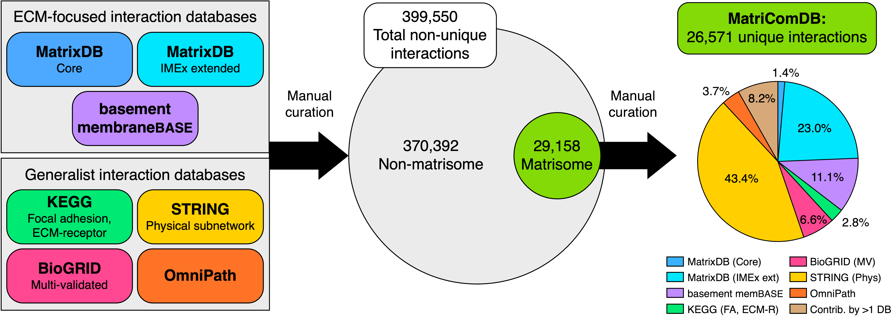
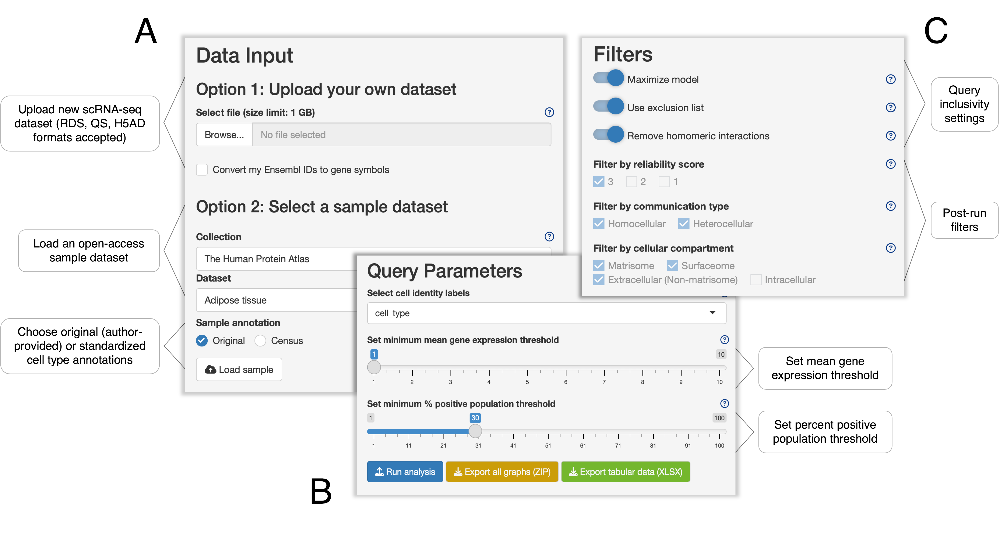

# MatriCom: matrisome communication in single-cell RNA-seq data.

* MatriCom features an intuitive graphical user interface implemented in R Shiny
* MatriCom is available **ready-to-use** online at https://matrinet.shinyapps.io/matricom/
* For a local installation of MatriCom on your own computer, see [installation instructions](INSTALL.md)

[]

* Manuscript available at: [doi XXXX](https://doi.org/) (*preprint at bioRxiv*)
* Our curated *MatricomDB* database, an integral part of the MatriCom package, is also [available separately](inst/webApp/www/omnibus/)
* Analysis data: [matRicom-analysisCode](https://github.com/Izzilab/matRicom-suppData)
* Authors and maintainers: IzziLab (✉️ <valerio.izzi@oulu.fi>) and Naba Lab (✉️ <anaba@uic.edu>)
* This work was supported by the following grants (green: Naba lab; blue: Izzi lab):

## Motivation
Single-cell RNAseq (scRNA-seq) enables the study of cell-cell communication within entire tissues, organs and systems. While the relative composition of the matrisome - a complex meshwork of extracellular matrix (ECM) proteins and other associated ones, endowed with scaffolding, enzymatic and signaling activities necessary to multicellular organization - can be studied in high detail with scRNA-seq, its role in forming communication networks within tissues and organs cannot be studied equally in depth with existing computational tools. In fact, the biology of the matrisome differs in many ways from that of the intracellular proteome, resulting in an under-representation of matrisome interactions by other tools whose algorithms are tailored towards the intracellular proteome and the signalosome.

To overcome these limitations, here we present MatriCom, a tool available as both an online and an offline Shiny App to study Matrisome-Matrisome and Matrisome-Cell communication patterns in scRNA-seq data. 

## MatricomDB database
MatriCom finds communicating pairs within single cell RNA Sequencing (scRNA-seq) data by scanning our curated *MatricomDB* database ([available here](inst/webApp/www/omnibus.xlsx) as a spreadsheet file for use outside the app). MatricomDB was constructed by combining the following 7 databases: [MatrixDB](http://matrixdb.univ-lyon1.fr/) (core) & (IMEx), [Basement membraneBASE](https://bmbase.manchester.ac.uk/), [KEGG](https://www.genome.jp/kegg/), [STRING](https://string-db.org/) (physical subnetwork), [BioGRID](https://thebiogrid.org/) (multi-validated) and [OmniPath](https://omnipathdb.org/) (Figure 1). The combined resource was then manually curated to include only communication pairs that feature at least one matrisome component and to characterise each pair by its database source, type of interaction (matrisome-matrisome or matrisome-cell), localization of each partner (matrisome, extracellular (non-matrisome), surfaceome, intracellular), and the divisions and categories of the matrisome partners.  

  
**Figure 1. Construction of the MatricomDB Database.**

## Workflow
The graphical user interface of MatriCom features a single input panel with three major sections: *Data Input*, *Query Parameters*, and *Filters* (Figure 2). With the help of MatricomDB, we can identify matrisome-specific communication pairs between cell types in scRNA-seq data, as follows.

### Data Input
Users upload their scRNA-seq data, in one of the supported formats (Figure 2 A). The online version of MatriCom additionally provides the input option to select a sample from open access data, publicly-available online. Here, we offer analytical access to the entire [Tabula Sapiens](https://tabula-sapiens-portal.ds.czbiohub.org/) collection, the [Human Protein Atlas](https://www.proteinatlas.org/) (THPA) collection and an expanding set of data from the [Azimuth](https://azimuth.hubmapconsortium.org/) app collection. Where possible, THPA and Azimuth datasets are offered with both original and [Census](https://github.com/sjdlabgroup/Census) cell type labels (Figure 2 A, Sample annotation), to guarantee standardization with the cell type assignment in Tabula Sapiens.

### Query Parameters
The algorithm considers all genes from the input data that pass the thresholds for mean (x̄) gene expression and percentage of positive cells. Both threshold values can be adjusted by the user (Figure 2 B). They represent the minimum x̄-gene expression level at which a gene should be present in any population, and the minimum amount of cells (per cell population) which should express the gene at that x̄ level. 

**Identification of communication pairs**  
Within this pool of genes, MatriCom finds communicating pairs across cell types (as well as among cells of the same type) and reports these interactions in graphical and tabular formats (Figure 3, but see section [Results output](#results-output) for details).

### Filters
A set of query inclusivity filters (filters for model maximization, exclusion list and homomeric interactions), as well as custom algorithms is then applied. This avoids reporting "impossible" partners (e.g., collagen subunits produced by different cells) and to further remove redundancies and ease interpretation. All these filters can be turned on and off by the user (Figure 2 C).

* **Maximize model.** The MatricomDB database was curated from multiple sources, therefore the analysis may return duplicate entries of the same interaction with different reliability scores. Selecting the **Maximize model** option will only return interactions with the highest reliability score in case of duplicates. This filter also excludes "reciprocal duplicates" (inverted entries), effectively removing one of the pairs in the situation where _GENE1_ ⮂ _GENE2_ between Population-A ⮂ Population-B and _GENE2_ ⮂ _GENE1_ between Population-B ⮂ Population-A occur in the results. By default, this filter is active.

* **Use exclusion list.** Various multimeric matrisome proteins cannot be produced by the cooperation of multiple, different cell populations, e.g. collagen or laminin multimers must be assembled within a single cell prior to secretion to the extracellular space. Selecting the **Use exclusion list** option, any of these multimers resulting from heterocellular interactions are removed from ther results. By default, this filter is active.

* **Remove homomeric interactions.** Some matrisome multimers are the product of a single gene (e.g. *COL1A1*), and scoring such communication pairs would actually just mean validating the presence of one gene in a population, very likely biasing the results. Selecting the **Remove homomeric interactions** option will remove these pairs from the results. By default, this filter is active.

Post-run filters for reliability, communication types and cellular compartments are also available.

* **Filter by reliability score.** Used to rank the results. The databases that build up Omnibus are ranked based on their level of experimental validation into 3 reliability levels (Figure 2 C and column `relscore` in [omnibus.xlsx](inst/webApp/www/omnibus.xlsx)). Users can restrict results based on reliability levels (default is set at 3 for stringency).
  * **Level 3**: the best and most reliable interactions coming from databases that are fully dedicated to the matrisome and where all interactions have been experimentally validated: -- MatrixDB core and KEGG.
  * **Level 2**: reliable interactions by dedicated databases, not all the interactions here have been experimentally validated -- MatrixDB IMEx, basement membraneBASE
  * **Level 1**: less relibale interactions sourced by massive, generalistic interaction databases, such as STRING (only the physical subnetwork), BioGRID (only the multivalidated dataset), and OmniPath.

* **Filter by communication types.** Users can filter the results to only include communication pairs between the same (homocellular) or different (heterocellular) cell types. By default, MatriCom includes both the types of communication in the results

* **Filter by cellular compartment.** Here (Figure 2 C), users can filter the results according to the localization of the communicating proteins: matrisome, cell surface (surfaceome), extracellular space (non-matrisome), or intracellular space. Note that all the results generated by MatriCom involve always at least one matrisome gene, so deselecting the "matrisome" option will remove **all** results. In case a protein has multiple locations, we implemented the following hierarchy:

  * Matrisome > Surfaceome > Extracellular (non-matrisome) > Intracellular.

  Genes encoding proteins that do not fall into one of the three highest-ranked compartments are marked as intracellular, which is deselected by default. Sources for localization annotations are [The Matrisome Project](https://sites.google.com/uic.edu/matrisome/home), the _in silico_ human [Surfaceome](https://doi.org/10.1073/pnas.1808790115), and [Gene Ontology GO:0005576 (extracellular region)](https://www.ebi.ac.uk/QuickGO/term/GO:0005576).

**Figure 2. MatriCom user interface.** The panel has three parts, shown separately here. A) Data input, where users can either upload their own dataset in `*.rds`, `*.qs` or `*.h5ad` format (Option 1), or load an open access dataset sample (Option 2). B) Query parameters. Users can adjust thresholds for gene expresion and percentage of positive cells population. C) Query inclusivity and post-run filters.

## Results output
MatriCom outputs results both as interactive graphics and as dynamic tables, assorted into 3 results tabls: _COMMUNICATION NETWORK_, _NETWORK INFLUENCERS_ and _ENRICHMENT ANALYSIS_. All data is downloadable as graphics and tables. 

As a demonstration, we loaded *Adipose tissue* from *The Human Protein Atlas* in Data Input - Option 2 and ran the analysis with default query parameters and filters. The results in the _COMMUNICATION NETWORK_ tab feature a cluster map of global communications (Figure 3 A), the fraction of Cell-matrisome and Matrisome-matrisome communication pairs (Figure 3 B) and gene pairs within matrisome (Figure 3 C); a detailed table is also provided (Figure 3 D). Influencers and influenced genes in the network (Figure 3 E) are featured in the _NETWORK INFLUENCERS_ tab. Network analysis algorithms are finally utilized to identify the most influential genes in the system, and matrisome signature-specific enrichment is performed (Figure 3 F), using [matrisome-MSigDB](https://sites.google.com/uic.edu/matrisome/resources/matrisome-msigdb), a set of specific molecular signatures recently released by the Naba Lab. These are shown in the _ENRICHMENT ANALYSIS_ tab.

**Figure 3. Example results.** A) Global communication cluster map, featuring the number of interactions reported for all population-pairs. Bubbles sizes are proportional to the number of interactions. Hovering the mouse cursor reveals the identities of the interacting cell populations.​ B) Communication pairs, shown as the percentage of for Cell-matrisome and Matrisome-matrisome. C) Matrisome pairs between genes shown as dot plot. D) The full list of interacting genes and populations is shown as a table, outlying among other features, their reliability levels score. E) Network influencers and influenced genes. F) Matrisome-specific signature enrichment.

## See also
* [Naba lab](https://sites.google.com/a/uic.edu/nabalab/): official web-site and [@GitHub](https://github.com/Matrisome/).
* [Izzi lab](https://www.oulu.fi/en/research-groups/izzi-group): official website and [@GitHub](https://github.com/izzilab).
* [The Matrisome project](https://sites.google.com/uic.edu/matrisome/home): an open access resource which aims to support and facilitate ECM research by sharing detailed protocols, tools, and datasets with the scientific community.
* [MatrisomeDB](https://matrisomedb.org/): a searchable database that integrates experimental proteomic data on the ECM composition of normal and diseased tissues.
* [Matrisome analyzer](https://github.com/Matrisome/MatrisomeAnalyzeR): An R package for ECM molecule annotation, classification, and analysis.
* [MatriNet](https://www.matrinet.org/): an interactive database to study the connectome and the network profiles of the extracellular matrix (ECM) in healthy and neoplastic tissues and cells.
* [ProToDeviseR](https://github.com/Izzilab/protodeviser): An R package for the automatic generation of protein topology schemes in JSON format.
